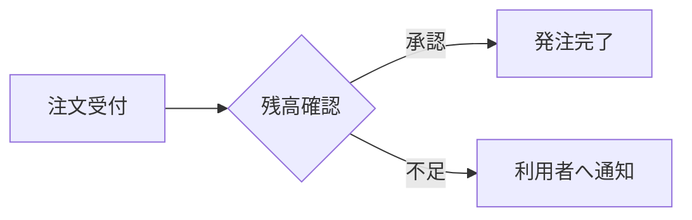
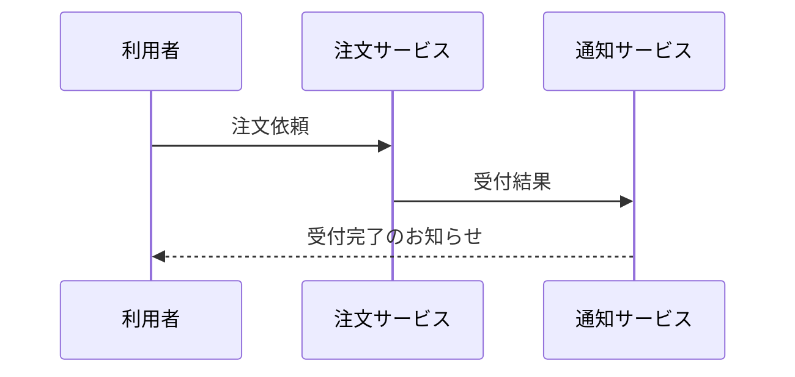

# 取引フロー

## 注文受付

```mermaid
flowchart LR
  A["注文受付"] --> B{"残高確認"}
  B -->|承認| C["発注完了"]
  B -->|不足| D["利用者へ通知"]
```

## 結果通知

```mermaid
sequenceDiagram
  participant U as 利用者
  participant S as 注文サービス
  participant N as 通知サービス
  U->>S: 注文依頼
  S->>N: 受付結果
  N-->>U: 受付完了のお知らせ
```
