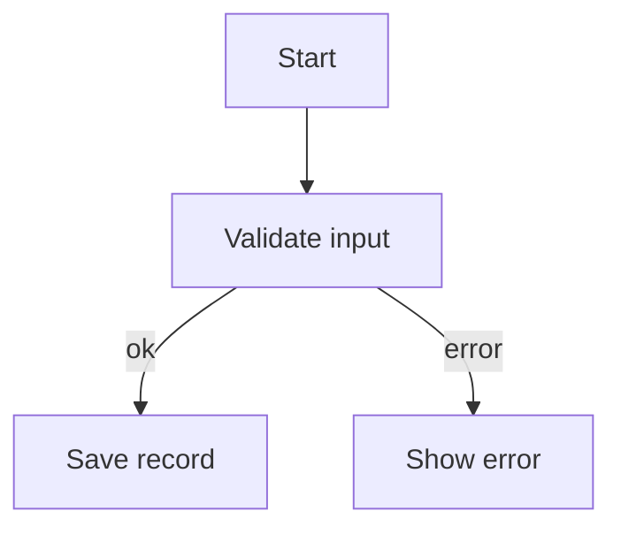
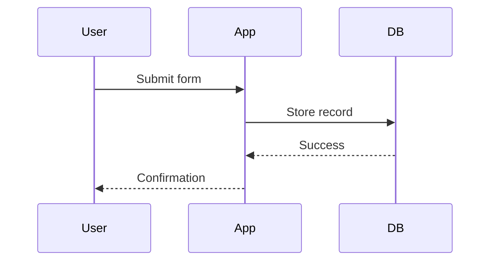
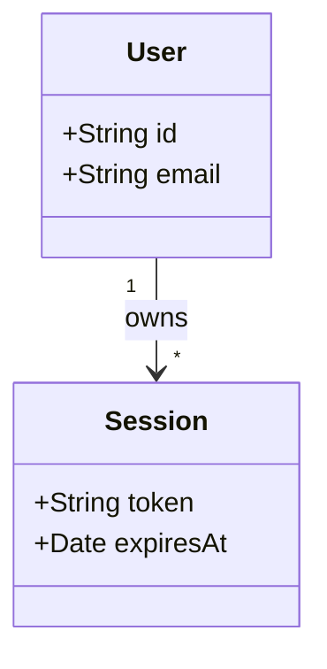
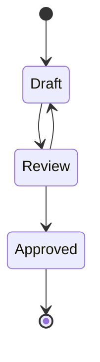
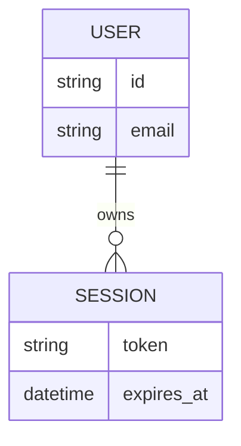

# Diagram Patterns

各図種別の最小成功例です。新規作成や修正時に、まずこれに寄せてから広げると安全です。

## flowchart

```mermaid
flowchart TD
    Start["Start"] --> Validate["Validate input"]
    Validate -->|ok| Save["Save record"]
    Validate -->|error| Reject["Show error"]
```

## sequenceDiagram

```mermaid
sequenceDiagram
    participant U as User
    participant A as App
    participant D as DB
    U->>A: Submit form
    A->>D: Store record
    D-->>A: Success
    A-->>U: Confirmation
```

## classDiagram

```mermaid
classDiagram
    class User {
      +String id
      +String email
    }
    class Session {
      +String token
      +Date expiresAt
    }
    User "1" --> "*" Session : owns
```

## stateDiagram-v2

```mermaid
stateDiagram-v2
    [*] --> Draft
    Draft --> Review
    Review --> Approved
    Review --> Draft
    Approved --> [*]
```

## erDiagram

```mermaid
erDiagram
    USER ||--o{ SESSION : owns
    USER {
      string id
      string email
    }
    SESSION {
      string token
      datetime expires_at
    }
```
